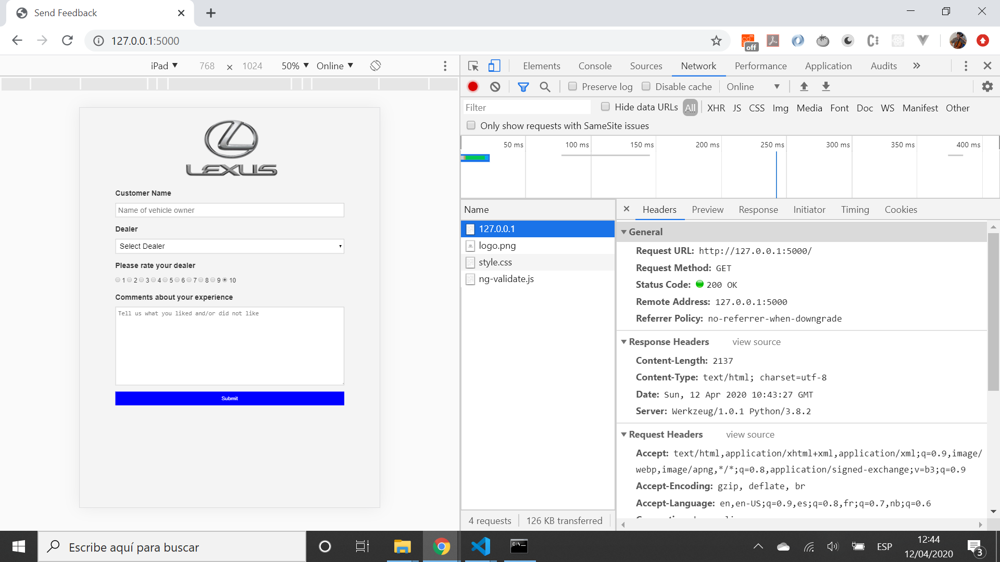

# Python-Flask PostreSQL Heroku

App to display a feedback form using Python Flask, PostgreSQL & mailtrap.io. We will also deploy it to Heroku. Tutorial code from [Traversy Media, Youtube video: Build & Deploy A Python Web App | Flask, Postgres & Heroku](https://www.youtube.com/watch?v=w25ea_I89iM)

## Table of contents

* [General info](#general-info)
* [Screenshots](#screenshots)
* [Technologies](#technologies)
* [Setup](#setup)
* [Features](#features)
* [Status](#status)
* [Inspiration](#inspiration)
* [Contact](#contact)

## General info

* Choosing between Flask and Django Python frameworks - Flask is more lightweight and better for small apps such as this one

## Screenshots



## Technologies

* [Python v3.8.2](https://www.python.org/) programming language
* [Flask v1.1.2](https://palletsprojects.com/p/flask/) micro-framework
* [psycopg2 v2.8.5](https://pypi.org/project/psycopg2/) PostgreSQL database adapter for the Python programming language
* [flask-sqlalchemy v2.x](https://flask-sqlalchemy.palletsprojects.com/en/2.x/) extension for Flask that adds support for SQLAlchemy
* [gunicorn v20.0.4](https://gunicorn.org/) Python WSGI HTTP Server for UNIX

## Setup

* Create PostgreSQL database and add access credentials to app.py
* Create mailtrap.io account and add access credentials to send_mail.py
* Run `pipenv shell` then `pipenv install` to install dependencies
* Run `python app.py` to open app in server `localhost: 5000`

## Code Examples

* tba

```python

```

## Features

* tba

## Status & To-do list

* Status: in dev

* To-do: complete tutorial

## Inspiration

* [Traversy Media, Youtube video: Build & Deploy A Python Web App | Flask, Postgres & Heroku](https://www.youtube.com/watch?v=w25ea_I89iM)
* [How to Install python 3.8 on Windows 10](https://www.youtube.com/watch?v=bnhQBUEpWlg)

## Contact

Repo created by [ABateman](https://www.andrewbateman.org) - feel free to contact me!
